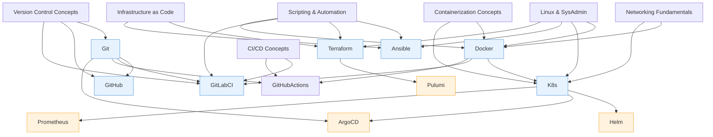

# Learning Path — DevOps

> A suggested progression from beginner to confident practitioner. Each stage builds on the previous one. If a topic is listed but has no content yet, it's marked as ⏳ (coming soon).

## Stage 1: Foundations

These concepts have no prerequisites — start here if you're new to the domain. Each primer exists on disk.

- **Version Control Concepts** — Understand what version control is, why teams use it, and the basic commit/push/pull cycle. Unlocks: Git, GitHub, GitLab CI.
- **Linux & System Administration** — Basic command-line fluency, package managers, file permissions, processes, and services. Unlocks: Docker, Kubernetes, Ansible, Terraform.
- **Scripting & Automation (Bash/Python)** — Writing shell scripts and simple Python programs to automate repetitive tasks. Unlocks: Terraform, Ansible, GitLab CI, Docker.
- **Networking Fundamentals** — IP addresses, ports, DNS, HTTP, and basic network troubleshooting. Unlocks: Docker, Kubernetes.
- **Containerization Concepts** — What containers are, how they differ from VMs, and why they matter. Unlocks: Docker, Kubernetes.
- **Infrastructure as Code Concepts** — Managing infrastructure through declarative configuration files. Unlocks: Terraform, Ansible.
- **CI/CD Concepts** — The build-test-deploy pipeline, why automation matters, and how it fits into a team workflow. Unlocks: GitLab CI, GitHub Actions.

## Stage 2: Core Tools

These tools are unlocked from the start and form the day-to-day toolkit for any DevOps engineer.

- **[Git](Git/notes/0000-primer-git.md)** — The foundation of version control. Start with the primer, work through CLI exploration, branching, merging, and hooks.
- **[GitHub](GitHub/notes/0000-primer-github.md)** — The most popular Git hosting platform. Learn repos, issues, PRs, the GitHub flow, and the `gh` CLI.
- **[Docker](Docker/notes/0000-primer-docker.md)** — Containerisation fundamentals. Start with the primer, build images, run containers, and learn Compose for multi-service apps.
- **[Ansible](Ansible/notes/0000-primer-ansible.md)** — Agentless automation for configuration management and provisioning. Primer, ad-hoc commands, playbooks, and troubleshooting.
- **[Kubernetes](Kubernetes/notes/0000-primer-kubernetes.md)** — Container orchestration at scale. Primer, `kubectl` exploration, manifests, and pod lifecycle management.
- **[Terraform](Terraform/notes/0000-primer-terraform.md)** — Declarative infrastructure provisioning. Primer, init/plan/apply workflow, configs, and reusable modules.

## Stage 3: Building Skills

Intermediate concepts and tools that depend on Stage 1 foundations and Stage 2 tools.

- **Git branching strategies** — Feature branches, GitFlow, trunk-based development, and when to use each. [Comparison doc](Git/docs/git-workflows-comparison.md)
- **Git worktrees** — Working on multiple branches simultaneously without stashing. [Worktrees doc](Git/docs/git-worktrees-parallel-feature-development.md)
- **Docker Compose** — Defining and running multi-container applications. [Quickstart notes](Docker/notes/2026-06-07-docker-compose-quickstart.md), [multi-service manifest](Docker/manifests/2026-06-13-web-db-compose.yaml)
- **Docker networking** — Understanding bridge, host, overlay, and macvlan drivers. [Notebook](Docker/notebooks/comparing-docker-networking-drivers.ipynb)
- **Ansible playbook troubleshooting** — SSH, pipx, and permission issues. [Troubleshooting notes](Ansible/notes/2026-06-13-ansible-playbook-troubleshooting.md)
- **Ansible linting** — Integrating ansible-lint into your workflow. [Lint guide](Ansible/docs/2026-06-15-wiring-ansible-lint.md)
- **Ansible variable precedence** — Understanding how group_vars, host_vars, and playbook vars interact. [Notebook](Ansible/notebooks/ansible-variable-precedence.ipynb)
- **GitLab CI** — Pipelines, runners, stages, and jobs. [Primer](GitLab%20CI/notes/0000-primer-gitlab-ci-cd.md), [pipeline config](GitLab%20CI/configs/2026-06-22-first-pipeline.yaml), [runner setup](GitLab%20CI/scripts/2026-06-22-install-runner-and-register.sh)

## Stage 4: Advanced Tools

Tools that depend on foundational concepts at L2 or core tools at L2+.

- **GitHub Actions** — CI/CD integrated with GitHub. [Quickstart notes](GitHub%20Actions/notes/2026-06-23-following-github-actions-quickstart.md), [workflow config](GitHub%20Actions/configs/2026-06-23-first-ci-workflow-with-env-and-secrets.yaml)
- **Helm** ⏳ — Kubernetes package manager. Depends on K8s L2 + Docker L2. Content coming.
- **ArgoCD** ⏳ — GitOps deployment for Kubernetes. Depends on K8s L2 + Git L2. Content coming.
- **Prometheus** ⏳ — Monitoring and alerting toolkit. Depends on Docker L2 + K8s L2. Content coming.
- **Trivy** ⏳ — Container vulnerability scanner. Depends on Docker L2. Content coming.

## Stage 5: Mastery

Advanced concepts and expert-level tool content.

- **GitLab CI/CD** — Advanced pipeline patterns, multi-project pipelines, and custom runners.
- **Terraform modules and workspaces** — Building reusable modules and managing multiple environments.
- **Kubernetes production patterns** — Ingress controllers, service meshes, autoscaling, and security policies.
- **Pulumi** ⏳ — Infrastructure as code with general-purpose programming languages. Depends on Terraform L3.
- **HashiCorp Vault** ⏳ — Secrets management and access control. Depends on Docker L2 + K8s L3.

## Progression Map

_Last updated: 2026-06-26_
