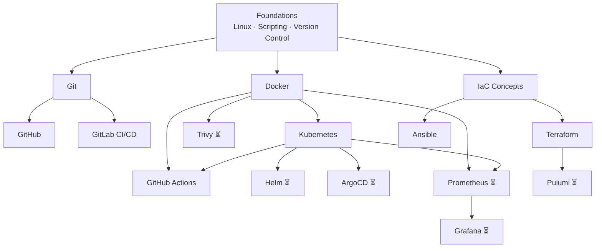

# Learning Path — DevOps

> A suggested progression from beginner to confident practitioner. Each stage builds on the previous one. If a topic is listed but has no content yet, it's marked as ⏳ (coming soon).

## Stage 1: Foundations

Start here — no prerequisites required.

- **Version Control Concepts** — Understand why we track changes, how commits work, and the difference between centralized and distributed systems. ⏳
- **Linux & System Administration** — Basic command-line fluency, file permissions, processes, and package management. ⏳
- **Scripting & Automation (Bash/Python)** — Automate repetitive tasks with shell scripts and Python. ⏳
- **Git** — Install, configure, and make your first commit. Work with branches, remotes, and merges. [Primer](../Git/notes/0000-primer-git.md) · [Install notes](../Git/notes/2026-06-04-install-git.md) · [CLI exploration](../Git/notes/2026-06-04-explore-git-cli.md)

## Stage 2: Core Tools

Once you're comfortable with Git and the command line, add these.

- **Docker** — Build images, run containers, manage volumes and networks, and use Docker Compose. [Primer](../Docker/notes/0000-primer-docker.md) · [Install & run](../Docker/scripts/install-and-run-first-container.sh) · [CLI notes](../Docker/notes/2026-06-06-exploring-docker-cli.md) · [Compose quickstart](../Docker/notes/2026-06-07-docker-compose-quickstart.md)
- **GitHub** — Repos, issues, pull requests, and the GitHub flow. [Primer](../GitHub/notes/0000-primer-github.md) · [CLI & web exploration](../GitHub/notes/2026-06-07-explore-github-web-and-cli.md) · [GitHub flow](../GitHub/notes/2026-06-15-hello-world-guide-and-github-flow.md)
- **Infrastructure as Code Concepts** — Declarative vs imperative, state management, and idempotency. ⏳
- **CI/CD Concepts** — Pipelines, stages, jobs, and the CI/CD workflow. [Primer](../docs/concepts/ci-cd-concepts/0000-primer-ci-cd-concepts.md)

## Stage 3: Building Skills

Deepen your knowledge and start managing real infrastructure.

- **Ansible** — Write playbooks, manage inventories, and automate server configuration. [Primer](../Ansible/notes/0000-primer-ansible.md) · [Getting started](../Ansible/notes/2026-06-11-ansible-getting-started.md) · [Playbook troubleshooting](../Ansible/notes/2026-06-13-ansible-playbook-troubleshooting.md) · [Variable precedence notebook](../Ansible/notebooks/ansible-variable-precedence.ipynb)
- **Kubernetes** — Pods, deployments, services, ConfigMaps, and Secrets. [Primer](../Kubernetes/notes/0000-primer-kubernetes.md) · [kubectl exploration](../Kubernetes/notes/2026-06-06-exploring-kubectl.md) · [Install kind](../Kubernetes/scripts/install-kind-and-first-cluster.sh)
- **Terraform** — Providers, state, plan, apply. Manage infrastructure declaratively. [Primer](../Terraform/notes/0000-primer-terraform.md) · [CLI exploration](../Terraform/notes/2026-06-06-exploring-terraform-cli.md) · [Bootstrap project](../Terraform/scripts/2026-06-12-bootstrap-terraform-project.sh)
- **GitLab CI** — Write pipelines, register runners, and automate testing. [Primer](../GitLab%20CI/notes/0000-primer-gitlab-ci-cd.md) · [First pipeline](../GitLab%20CI/configs/2026-06-22-first-pipeline.yaml)
- **Containerization Concepts** — Images, layers, registries, and orchestration fundamentals. ⏳

## Stage 4: Advanced Tools

These tools depend on foundational knowledge from earlier stages.

- **GitHub Actions** — Build CI/CD workflows with actions, secrets, and matrix builds. [Quickstart notes](../GitHub%20Actions/notes/2026-06-23-following-github-actions-quickstart.md) · [First workflow](../GitHub%20Actions/configs/2026-06-23-first-ci-workflow-with-env-and-secrets.yaml)
- **Helm** — Package Kubernetes applications as reusable charts. ⏳
- **ArgoCD** — GitOps-style continuous delivery for Kubernetes. ⏳
- **Prometheus** — Monitor infrastructure and applications with metrics and alerts. ⏳
- **Trivy** — Scan containers and infrastructure for vulnerabilities. ⏳

## Stage 5: Mastery

Expert-level tools and concepts.

- **Networking Fundamentals** — DNS, HTTP, load balancers, and network policies. ⏳
- **Monitoring & Observability Concepts** — Metrics, logs, traces, and alerting. ⏳
- **Grafana** — Dashboards and visualizations for monitoring data. ⏳ (locked until Prometheus L2)
- **Pulumi** — Infrastructure as code using general-purpose programming languages. ⏳ (locked until Terraform L3)
- **HashiCorp Vault** — Secrets management and encryption. ⏳

## Progression Map

*Tools marked ⏳ have no content yet. Links are added as content is created.*
