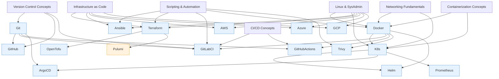

# Learning Path — DevOps

> A suggested progression from beginner to confident practitioner. Each stage builds on the previous one. If a topic is listed but has no content yet, it's marked as ⏳ (coming soon).

## Stage 1: Foundations

These concepts have no prerequisites — start here if you're new to the domain. Each primer exists on disk.

- **Linux & System Administration** — Basic command-line fluency, package managers, file permissions, processes, and services. [Primer](../docs/concepts/linux-system-administration/0000-primer-linux-system-administration.md) · [Process and permission patterns](../docs/concepts/linux-system-administration/2026-07-18-process-and-permission-patterns-in-devops.md) · [Permissions and process management script](../docs/concepts/linux-system-administration/2026-07-18-filesystem-permissions-and-process-management.sh) Unlocks: Docker, Kubernetes, Ansible, Terraform, AWS, Azure.
- **Scripting & Automation (Bash/Python)** — Writing shell scripts and simple Python programs to automate repetitive tasks. [Primer](../docs/concepts/scripting-automation-bash-python/0000-primer-scripting-automation-bash-python.md) Unlocks: Terraform, Ansible, GitLab CI, Docker, Trivy.
- **Networking Fundamentals** — IP addresses, ports, DNS, HTTP, and basic network troubleshooting. [Primer](../docs/concepts/networking-fundamentals/0000-primer-networking-fundamentals.md) · [Netcat and curl connectivity script](../docs/concepts/networking-fundamentals/2026-07-18-netcat-and-curl-connectivity.sh) Unlocks: Docker, Kubernetes.
- **CI/CD Concepts** — The build-test-deploy pipeline, why automation matters, and how it fits into a team workflow. [Primer](../docs/concepts/ci-cd-concepts/0000-primer-ci-cd-concepts.md) Unlocks: GitLab CI, GitHub Actions.
- **Containerization Concepts** — Packaging applications with their runtime into portable units. [Primer](../docs/concepts/containerization-concepts/0000-primer-containerization-concepts.md) Unlocks: Docker, Kubernetes.
- **Infrastructure as Code Concepts** — Managing infrastructure through machine-readable definition files instead of manual processes. [Primer](../docs/concepts/infrastructure-as-code-concepts/0000-primer-infrastructure-as-code-concepts.md) Unlocks: Terraform, Ansible, AWS, Azure, GCP.
- **Version Control Concepts** — Tracking changes to files over time with commits, branches, and pull requests. [Primer](../docs/concepts/version-control-concepts/0000-primer-version-control-concepts.md) Unlocks: Git, GitHub.
- **Monitoring & Observability** — Metrics, logs, traces, SLIs, SLOs, and alerting for understanding production system behaviour. [Primer](../docs/concepts/monitoring-observability-concepts/0000-primer-monitoring-observability-concepts.md) Unlocks: Prometheus, Grafana.

## Stage 2: Core Tools

These tools are unlocked from the start and form the day-to-day toolkit for any DevOps engineer.

- **[Git](../Git/notes/0000-primer-git.md)** — The foundation of version control. Start with the primer, work through CLI exploration, branching, merging, and hooks.
- **[GitHub](../GitHub/notes/0000-primer-github.md)** — The most popular Git hosting platform. Learn repos, issues, PRs, the GitHub flow, and the `gh` CLI.
- **[Docker](../Docker/notes/0000-primer-docker.md)** — Containerisation fundamentals. Start with the primer, build images, run containers, and learn Compose for multi-service apps.
- **[Ansible](../Ansible/notes/0000-primer-ansible.md)** — Agentless automation for configuration management and provisioning. Primer, ad-hoc commands, playbooks, and troubleshooting.
- **[Kubernetes](../Kubernetes/notes/0000-primer-kubernetes.md)** — Container orchestration at scale. Primer, `kubectl` exploration, manifests, and pod lifecycle management.
- **[Terraform](../Terraform/notes/0000-primer-terraform.md)** — Declarative infrastructure provisioning. Primer, init/plan/apply workflow, configs, and reusable modules.

## Stage 3: Building Skills

Intermediate concepts and tools that depend on Stage 1 foundations and Stage 2 tools.

- **Git branching strategies** — Feature branches, GitFlow, trunk-based development, and when to use each. [Comparison doc](../Git/docs/git-workflows-comparison.md)
- **Git worktrees** — Working on multiple branches simultaneously without stashing. [Worktrees doc](../Git/docs/git-worktrees-parallel-feature-development.md)
- **Docker Compose** — Defining and running multi-container applications. [Quickstart notes](../Docker/notes/2026-06-07-docker-compose-quickstart.md), [multi-service manifest](../Docker/manifests/2026-06-13-web-db-compose.yaml), [Go + Redis with health checks](../Docker/manifests/2026-06-28-go-redis-compose-healthchecks.yaml)
- **Docker networking** — Understanding bridge, host, overlay, and macvlan drivers. [Notebook](../Docker/notebooks/comparing-docker-networking-drivers.ipynb)
- **Ansible playbook troubleshooting** — SSH, pipx, and permission issues. [Troubleshooting notes](../Ansible/notes/2026-06-13-ansible-playbook-troubleshooting.md)
- **Ansible hardening playbook** — nginx, PHP-FPM, and UFW on Ubuntu from a single playbook. [Playbook](../Ansible/configs/2026-07-19-nginx-phpfpm-ufw-ubuntu.yaml)
- **Ansible linting** — Integrating ansible-lint into your workflow. [Lint guide](../Ansible/docs/2026-06-15-wiring-ansible-lint.md)
- **Ansible variable precedence** — Understanding how group_vars, host_vars, and playbook vars interact. [Notebook](../Ansible/notebooks/ansible-variable-precedence.ipynb)
- **Kubernetes Ingress** — Configuring path-based routing and TLS. [Ingress guide](../Kubernetes/docs/ingress-path-based-routing.md)
- **Kubernetes pod troubleshooting** — Debugging network and filesystem issues from inside a pod. [Snippet](../Kubernetes/snippets/pod-troubleshoot-shell.sh)
- **GitLab CI** — Pipelines, runners, stages, and jobs. [Primer](../GitLab CI/notes/0000-primer-gitlab-ci-cd.md), [pipeline config](../GitLab CI/configs/2026-06-22-first-pipeline.yaml), [runner setup](../GitLab CI/scripts/2026-06-22-install-runner-and-register.sh)
- **Trivy** — Container image vulnerability scanning. [CLI exploration](../Trivy/notes/2026-06-25-exploring-trivy-cli.md), [image scan script](../Trivy/scripts/2026-06-26-scanned-first-container-image.sh)
- **Terraform workspaces and remote state** — Managing multiple environments with workspaces and locking state with S3 + DynamoDB. [Workspace guide](../Terraform/docs/2026-06-29-terraform-workspaces-and-remote-state-locking.md)
- **Terraform `for_each` vs `count`** — Choosing between conditional resource creation strategies. [Notebook](../Terraform/notebooks/2026-07-02-comparing-for-each-vs-count.ipynb)

## Stage 4: Advanced Tools

Tools that depend on foundational concepts at L2 or core tools at L2+.

- **GitHub Actions** — CI/CD integrated with GitHub. [Primer](../GitHub Actions/notes/0000-primer-github-actions.md), [quickstart notes](../GitHub Actions/notes/2026-06-23-following-github-actions-quickstart.md), [workflow with env/secrets](../GitHub Actions/configs/2026-06-23-first-ci-workflow-with-env-and-secrets.yaml), [hello workflow](../GitHub Actions/configs/2026-07-11-first-ci-workflow-hello.yaml)
- **GitHub auth for CI/CD** — Deploy keys vs fine-grained PATs for pipeline access to GitHub. [Comparison doc](../GitHub/docs/how-i-wired-deploy-keys-vs-fine-grained-pats-for-cicd.md)
- **GitHub issue forms and labels** — Configuring `.github` repository with issue forms (bug reports, feature requests) and label definitions. [Config files](../GitHub/configs/dot-github-repository/)
- **GitHub stale issue/PR automation** — Auto-marking and closing stale issues and PRs for the `.github` repository. [Automation config](../GitHub/configs/dot-github-repository/stale.yml)
- **AWS CLI** — Installing and configuring the AWS CLI v2 with named profiles for multi-account workflows. [Install script](../AWS/scripts/2026-07-13-install-aws-cli-v2-and-configure.sh), [config reference](../AWS/configs/2026-07-13-minimal-aws-config.ini)
- **Azure CLI** — Cross-platform CLI for managing Azure resources, subscriptions, and resource groups. [Install script](../Azure/scripts/2026-07-13-install-azure-cli-and-login.sh)
- **GCP (gcloud CLI)** — The Google Cloud SDK for managing GCP resources from the terminal. [Primer](../GCP/notes/0000-primer-gcp.md), [install and configure script](../GCP/scripts/2026-07-16-install-gcloud-cli-and-configure-creds.sh), [Compute/GCS listing snippet](../GCP/snippets/2026-07-16-list-compute-and-gcs-with-gcloud.sh)
- **OpenTofu** — The open-source Terraform fork. Start here if you want a community-governed IaC tool. [Primer](../OpenTofu/notes/0000-primer-opentofu.md), [install and verify script](../OpenTofu/scripts/2026-07-18-install-opentofu-and-verify.sh), [minimal local config](../OpenTofu/configs/2026-07-18-minimal-local-config.tf)
- **Helm** — Kubernetes package manager. Depends on K8s L2 + Docker L2. [Primer](../Helm/notes/0000-primer-helm.md), [install script](../Helm/scripts/2026-07-23-install-helm-and-explore-cli.sh), [chart inspection config](../Helm/configs/2026-07-23-first-helm-chart-inspection.yaml), [docs](../Helm/docs/2026-07-22-helm-added-to-readme.md)
- **ArgoCD** — GitOps deployment for Kubernetes. Depends on K8s L2 + Git L2. [Primer](../ArgoCD/notes/0000-primer-argocd.md), [install script](../ArgoCD/scripts/2026-07-23-install-argocd-and-access-ui.sh), [first Application manifest](../ArgoCD/configs/2026-07-23-first-application-manifest.yaml)
- **Prometheus** — Monitoring and alerting toolkit. Depends on Docker L2 + K8s L2. [Primer](../Prometheus/notes/0000-primer-prometheus.md), [install and verify script](../Prometheus/scripts/2026-07-23-install-prometheus-and-verify-metrics.sh), [minimal scrape config](../Prometheus/configs/2026-07-23-minimal-scrape-config.yml)

## Stage 5: Mastery

Advanced concepts and expert-level tool content.

- **GitLab CI/CD** — Advanced pipeline patterns, multi-project pipelines, and custom runners.
- **Terraform modules** — Building reusable modules. [S3 module](../Terraform/configs/reusable-s3-module/README.md)
- **Kubernetes production patterns** — Ingress controllers, service meshes, autoscaling, and security policies.
- **Helm chart authoring** — Creating and publishing your own charts.
- **Pulumi** ⏳ — Infrastructure as code with general-purpose programming languages. Depends on Terraform L3.
- **HashiCorp Vault** ⏳ — Secrets management and access control. Depends on Docker L2 + K8s L3.

## Progression Map

```mermaid
graph TD
    VC[Version Control Concepts] --> Git
    VC --> GitHub
    VC --> GitLabCI

    Linux[Linux & SysAdmin] --> Docker
    Linux --> K8s
    Linux --> Ansible
    Linux --> Terraform
    Linux --> AWS
    Linux --> Azure
    Linux --> GCP

    Scripting[Scripting & Automation] --> Ansible
    Scripting --> Terraform
    Scripting --> GitLabCI
    Scripting --> Docker
    Scripting --> Trivy

    Network[Networking Fundamentals] --> Docker
    Network --> K8s

    CI[CI/CD Concepts] --> GitLabCI
    CI --> GitHubActions

    Container[Containerization Concepts] --> Docker
    Container --> K8s

    IaC[Infrastructure as Code] --> Terraform
    IaC --> Ansible
    IaC --> AWS
    IaC --> Azure
    IaC --> GCP

    Git --> GitHub
    Git --> GitLabCI
    Git --> GitHubActions
    Git --> ArgoCD

    Docker --> K8s
    Docker --> GitLabCI
    Docker --> GitHubActions
    Docker --> Trivy
    Docker --> Helm

    K8s --> Helm
    K8s --> ArgoCD
    K8s --> Prometheus

    Terraform --> OpenTofu
    Terraform --> Pulumi

    classDef hasContent fill:#e6f3ff,stroke:#4a90d9
    classDef noContent fill:#fff3e0,stroke:#f5a623

    class Git,GitHub,Docker,K8s,Ansible,Terraform,GitLabCI,GitHubActions,Trivy,AWS,Azure,GCP,OpenTofu,Helm,ArgoCD,Prometheus hasContent
    class Pulumi,Vault noContent
```

_Last updated: 2026-07-23_